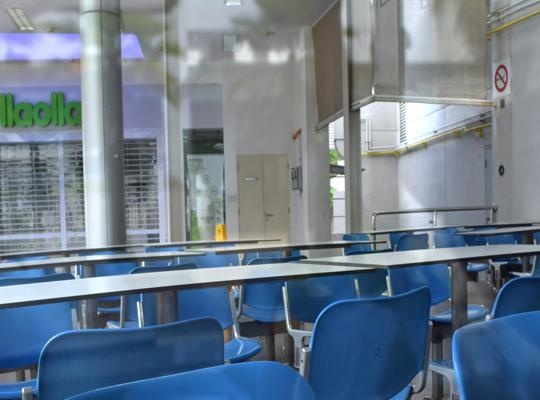
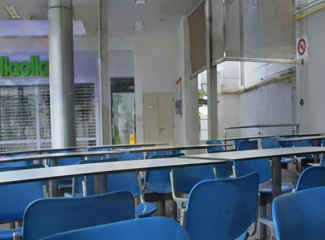

# GCNet

Single Image Reflection Removal based on GAN with Gradient Constraint

**Getting ready.**

|Input real image|Image generated by our method|
|:--:|:--:|
|||

The sample image is provided by [SIR2 benchmark dataset](https://sir2data.github.io/).

## Usage
Our code is based on pytorch.

## Citation

For further information, please contact: {abiko, ikehara}@tkhm.elec.keio.ac.jp
